# 前端开发指南 - 给大模型的核心信息

当您需要大模型协助前端开发时，请提供以下关键信息：

## 🎯 1. 项目基本信息

```
项目名称：De-AI-Hilfer (德语学习智能助手)
技术栈：React/Vue.js + TypeScript + Tailwind CSS
后端：De-AI-Hilfer-Backend (FastAPI)
部署：Vercel/Netlify (前端) + Railway/Render (后端)
```

## 📡 2. 核心API接口

### 基础查询接口
```javascript
// 获取最近条目
GET /api/v1/entries/recent?limit=10

// 获取所有条目
GET /api/v1/entries/all?page=1&size=20

// 搜索建议
GET /api/v1/suggestions?q=hallo
```

### 智能分析接口
```javascript
// 智能查询 (核心功能)
POST /api/v1/analyze
{
  "query_text": "德语单词、短语、前缀或后缀",
  "entry_type": "WORD" | "PHRASE" | "PREFIX" | "SUFFIX" // 可选，后端可自动推断
}

// 智能搜索
POST /api/v1/search/intelligent
{
  "term": "搜索词",
  "hints": ["提示1", "提示2"]
}
```

### 词根词缀分析接口
```javascript
// 统一分析接口支持词根词缀
POST /api/v1/analyze
{
  "query_text": "ver-",           // 前缀示例
  "entry_type": "PREFIX"          // 可选，后端自动识别
}

POST /api/v1/analyze
{
  "query_text": "-heit",          // 后缀示例
  "entry_type": "SUFFIX"          // 可选，后端自动识别
}

// 支持的条目类型
- WORD: 单词 (默认)
- PHRASE: 短语
- PREFIX: 前缀 (如 "ver-", "un-", "ge-")
- SUFFIX: 后缀 (如 "-heit", "-lich", "-ung")
```

### 知识库管理接口
```javascript
// 创建追问
POST /api/v1/follow-up
{
  "entry_id": 1,
  "question": "相关问题"
}

// 创建别名
POST /api/v1/alias
{
  "entry_id": 1,
  "alias": "别名",
  "alias_type": "变体|同义词|缩写"
}
```

## 🏗️ 3. 系统架构要点

### 后端架构特点
- **分层架构**：API端点层 → 业务逻辑层 → 核心服务层 → AI适配器层
- **AI服务集成**：支持Gemini、OpenAI、Ollama三种AI服务
- **缓存策略**：Redis缓存 + 前端缓存双重机制
- **降级机制**：AI服务不可用时的降级策略

### 数据模型核心
```javascript
// 知识条目结构
{
  id: number,
  word: string,
  word_type: string,
  definition: object,  // JSONB格式
  examples: array,     // JSONB格式
  difficulty_level: string,
  created_at: string,
  updated_at: string
}

// 追问结构
{
  id: number,
  entry_id: number,
  question: string,
  answer: string,
  question_type: string,
  difficulty_level: string
}
```

## 🎨 4. 前端功能模块

### 核心页面结构
```
1. 首页/搜索页
   - 搜索框
   - 搜索建议
   - 历史记录

2. 词条详情页
   - 单词信息展示
   - AI分析结果
   - 相关追问

3. 知识库管理页
   - 词条列表
   - 批量操作
   - 导入导出

4. 学习进度页
   - 个人学习统计
   - 复习计划
   - 掌握情况
```

### 关键交互流程

```mermaid
graph LR
    A[用户输入] --> B[搜索建议]
    B --> C[智能查询]
    C --> D[AI分析]
    D --> E[结果展示]
    E --> F[追问交互]
    F --> G[学习记录]
```


## 🔧 5. 技术实现要点

### API调用封装
```javascript
class ApiService {
  private baseUrl = 'http://localhost:8000/api/v1'
  
  async analyzeEntry(queryText: string, entryType?: string) {
    const response = await fetch(`${this.baseUrl}/analyze`, {
      method: 'POST',
      headers: { 'Content-Type': 'application/json' },
      body: JSON.stringify({ 
        query_text: queryText,
        entry_type: entryType // 可选，后端会自动推断
      })
    })
    return response.json()
  }
  
  async getSuggestions(term: string) {
    return fetch(`${this.baseUrl}/suggestions?q=${term}`).then(r => r.json())
  }
  
  // 词根词缀分析示例
  async analyzeAffix(affixText: string) {
    return this.analyzeEntry(affixText) // 后端自动识别为前缀或后缀
  }
}
```

### 缓存策略
```javascript
class QueryCache {
  private cache = new Map()
  private ttl = 5 * 60 * 1000 // 5分钟
  
  async get(key: string, fetcher: Function) {
    const cached = this.cache.get(key)
    if (cached && Date.now() - cached.timestamp < this.ttl) {
      return cached.data
    }
    
    const data = await fetcher()
    this.cache.set(key, { data, timestamp: Date.now() })
    return data
  }
}
```

### 错误处理
```javascript
const handleApiError = (error: any) => {
  if (error.status === 429) {
    // 限流处理
    return { error: '请求过于频繁，请稍后重试', retry: true }
  } else if (error.status >= 500) {
    // 服务器错误
    return { error: '服务暂时不可用', retry: false }
  } else {
    // 客户端错误
    return { error: error.message, retry: false }
  }
}
```

## 📱 6. 用户体验设计

### 界面布局建议
```
┌─────────────────────────────────┐
│  🔍 搜索框                    │
├─────────────────────────────────┤
│  📝 搜索建议 (下拉)            │
├─────────────────────────────────┤
│  📚 词条卡片                   │
│  ┌─────────────────────────────┐ │
│  │ 单词: hallo                │ │
│  │ 词性: interj.              │ │
│  │ 释义: 你好                 │ │
│  │ [AI分析结果]               │ │
│  │ [追问按钮]                 │ │
│  └─────────────────────────────┘ │
├─────────────────────────────────┤
│  📈 学习进度                   │
└─────────────────────────────────┘
```

### 响应式设计要点
- 移动端优先设计
- 触摸友好的交互
- 离线功能支持（PWA）
- 加载状态和骨架屏

## 🚀 7. 部署和配置

### 环境变量配置
```env
VITE_API_BASE_URL=http://localhost:8000/api/v1
VITE_APP_NAME=De-AI-Hilfer
VITE_VERSION=1.0.0
```

### 构建优化
```javascript
// vite.config.ts
export default defineConfig({
  build: {
    rollupOptions: {
      output: {
        manualChunks: {
          vendor: ['react', 'react-dom'],
          ui: ['@headlessui/react', '@heroicons/react']
        }
      }
    }
  }
})
```

## 📊 8. 性能监控

### 关键指标
- 首屏加载时间 < 2秒
- API响应时间 < 1秒
- 缓存命中率 > 80%
- 错误率 < 1%

### 监控实现
```javascript
// 性能监控
const observer = new PerformanceObserver((list) => {
  for (const entry of list.getEntries()) {
    if (entry.entryType === 'navigation') {
      console.log('页面加载时间:', entry.loadEventEnd - entry.fetchStart)
    }
  }
})
observer.observe({ entryTypes: ['navigation'] })
```

## 🔄 9. 开发工作流

### Git工作流
```bash
# 功能开发
git checkout -b feature/search-component
git commit -m "feat: 添加搜索组件"
git push origin feature/search-component

# 发布部署
git checkout main
git merge feature/search-component
git tag v1.1.0
git push origin main --tags
```

### 测试策略
```javascript
// 单元测试
describe('ApiService', () => {
  it('should analyze word entry', async () => {
    const result = await apiService.analyzeEntry('hallo')
    expect(result).toBeDefined()
    expect(result.query_text).toBe('hallo')
  })
  
  it('should analyze affix entry', async () => {
    const result = await apiService.analyzeEntry('ver-')
    expect(result).toBeDefined()
    expect(result.query_text).toBe('ver-')
  })
})

// 集成测试
it('should display search results', async () => {
  render(<SearchPage />)
  const input = screen.getByPlaceholderText('输入德语单词或词缀')
  fireEvent.change(input, { target: { value: 'ver-' } })
  await waitFor(() => {
    expect(screen.getByText('ver-')).toBeInTheDocument()
  })
})
```

## 💡 10. 常见问题解决

### API调用问题
```javascript
// 跨域问题解决
// 在vite.config.ts中配置代理
export default defineConfig({
  server: {
    proxy: {
      '/api': {
        target: 'http://localhost:8000',
        changeOrigin: true
      }
    }
  }
})
```

### 状态管理
```javascript
// 使用Zustand进行状态管理
import { create } from 'zustand'

interface AppState {
  searchQuery: string
  results: any[]
  loading: boolean
  setSearchQuery: (query: string) => void
  setResults: (results: any[]) => void
}

const useAppStore = create<AppState>((set) => ({
  searchQuery: '',
  results: [],
  loading: false,
  setSearchQuery: (query) => set({ searchQuery: query }),
  setResults: (results) => set({ results })
}))
```

---

## 🎯 给大模型的提示模板

当您需要大模型协助时，可以使用以下模板：

```
我正在开发De-AI-Hilfer德语学习应用的前端，需要你的帮助。

项目背景：
- 前端：React + TypeScript + Tailwind CSS
- 后端：FastAPI，提供智能德语分析API
- 核心功能：德语单词查询、词根词缀分析、AI分析、学习进度跟踪

当前需求：
[描述你的具体需求，例如：实现搜索组件、优化性能、解决bug等]

相关API接口：
- POST /api/v1/analyze (统一分析接口，支持单词、短语、前缀、后缀)
- GET /api/v1/suggestions?q={term} (搜索建议)
- POST /api/v1/follow-up (创建追问)

支持的条目类型：
- WORD: 单词 (默认)
- PHRASE: 短语
- PREFIX: 前缀 (如 "ver-", "un-", "ge-")
- SUFFIX: 后缀 (如 "-heit", "-lich", "-ung")

请提供具体的代码实现建议。
```

这份指南涵盖了前端开发的所有关键信息，包括新增的词根词缀分析功能，可以帮助大模型更好地理解您的项目需求并提供准确的帮助。
